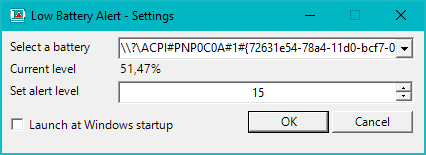

  

# LowBatteryAlert
 LowBatteryAlert is an utility to create individual "low battery" notifications for each of your computer battery (when you have multiple batteries like the Surface Book 2).

With LowBatteryAlert, you can set a different warning threshold for each battery and get notified for a specific battery level even if Windows consider the global level sufficient.

It is very useful when one of the batteries is being drained faster than others and the Windows global/average battery level still looks good.

For example:
Having Battery 1 is 100% full and Battery 2 is only 20%, Windows will compute a global battery level of 60% and will not trigger any battery warning.
However, LowBatteryAlert can be set to trigger a warning when Battery 2 reachs 20% independantly of the other battery level.

# Installation
1. Download the zip file in the Release section and put the embedded LowBatteryAlert.exe anywhere in a utilities folder on your computer.
2. Right-click LowBatteryAlert.exe and "Pin to start menu" for easy access

# Launch automatically when Windows starts
When the application is already started, find the LowBatteryIcon  in the taskbar (next to the clock), double-click on the icon (or right-click Settings) to open the Settings.
Then enable "Launch on Windows startup" option and press OK.

You can disable this auto-start by unticking the checkbox.

# Settings

1. Select the battery in the list
2. Set the threshold to trigger an alert (default 15 %)
3. Repeat for each battery
4. OK to save

# Warning
LowBatteryAlert notifications may be muted if you set your computer to "Do not disturb" mode. In that case no popup notification nor audio warning will be triggered.
The warning will still be visible in the notification area in the right-corner of the Windows taskbar.
